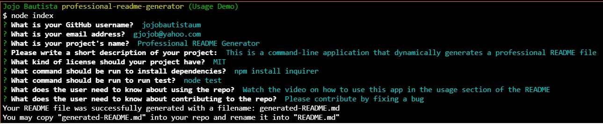
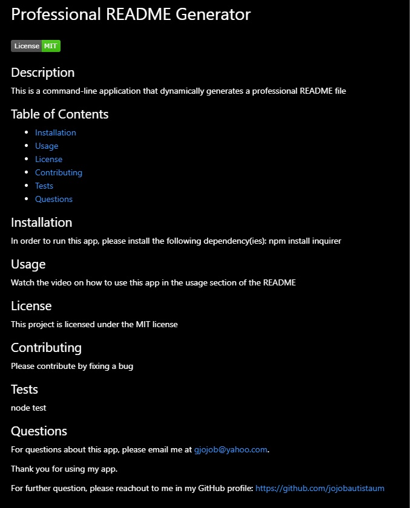

  # Professional README Generator
  

  ## Description
  This is a command-line application that dynamically generates a professional README file from a user's input using the Inquirer. It will create a **generated-README.md** file that can be copied and renamed into **README.md** in your Repository.

  ## Table of Contents
  * [Installation](#installation) 
  * [Usage](#usage) 
  * [License](#license)
  * [Contributing](#contributing) 
  * [Questions](#questions)

  ## Installation 
  In order to run this app, please install the following dependency:  
  **node install inquirer**

  ## Usage 
  ### 1.  Watch the video: 
  

  ### 2.  Sample User Input: 
  

  ### 3.  Preview of the Generated README file: 
  

  ## Tech/Framework
  * Node.js
  * Inquirer
  * File System
  * Screencastify

  ## License 
  This project is licensed under the MIT license

  ## Contributing 
  Please contribute by fixing an issue.

  ## Questions 
  For questions about this app, please email me at gjojob@yahoo.com.
  
  Thank you for using my app.

  For further question, please reachout to me in my GitHub profile: https://github.com/jojobautistaum
